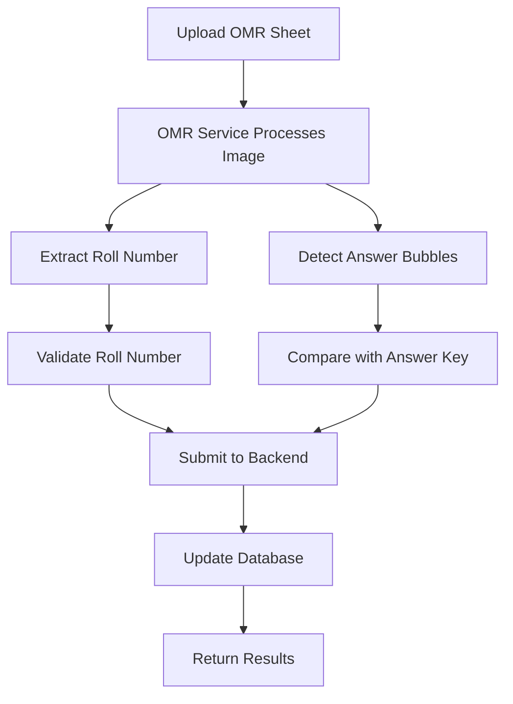

# OMR Scanner Integration Guide

## 🎯 Overview

This guide explains how to integrate the OMR (Optical Mark Recognition) scanner with your exam portal project. The OMR scanner is designed as a microservice that processes scanned OMR sheets and automatically grades them.

## 📁 Project Structure

```
exam-portal/
├── backend/                 # Your existing Node.js backend
├── frontend/               # Your existing React frontend  
├── omr-service/           # New Python OMR microservice
│   ├── app.py            # FastAPI application
│   ├── test_app.py       # Test version for development
│   ├── services/         # OMR processing logic
│   ├── models/           # Pydantic models
│   ├── utils/            # Utility functions
│   ├── venv/             # Python virtual environment
│   └── requirements.txt  # Python dependencies
└── docker-compose.yml    # Orchestrate all services
```

## 🚀 Quick Start

### 1. Setup Python Virtual Environment

```bash
cd /home/rayhan/Documents/exam-portal/omr-service
python3 -m venv venv
source venv/bin/activate
pip install --upgrade pip setuptools wheel
pip install -r requirements.txt
```

### 2. Start the OMR Service

```bash
# Test version (for development)
cd /home/rayhan/Documents/exam-portal/omr-service
source venv/bin/activate
python test_app.py
```

The service will be available at:
- **Service URL**: http://localhost:8001
- **API Docs**: http://localhost:8001/docs
- **Health Check**: http://localhost:8001/health

### 3. Test the Service

```bash
# Test health endpoint
curl http://localhost:8001/health

# Test basic endpoint
curl http://localhost:8001/

# Test POST endpoint
curl -X POST http://localhost:8001/test
```

## 🔧 Integration Steps

### Step 1: Add OMR Routes to Backend

Add the OMR routes to your main backend:

```javascript
// In backend/index.js
app.use('/api/omr', require('./routes/omr'));
```

### Step 2: Add OMR Component to Frontend

Add the OMR scanner component to your exam management:

```jsx
// In ExamManagement.jsx
import OMRScanner from './OMRScanner';

// Add OMR button in your exam management UI
<button 
  onClick={() => setShowOMRScanner(true)}
  className="px-4 py-2 bg-green-600 text-white rounded-md hover:bg-green-700"
>
  📄 Scan OMR Sheets
</button>

{showOMRScanner && (
  <OMRScanner
    examId={selectedExam?.id}
    classId={selectedSetForPDF?.id}
    onClose={() => setShowOMRScanner(false)}
    onSuccess={(results) => {
      success(`Processed ${results.length} OMR sheets successfully!`);
      // Refresh results or update UI
    }}
  />
)}
```

### Step 3: Environment Configuration

Add OMR service URL to your frontend environment:

```bash
# In frontend/.env
REACT_APP_OMR_SERVICE_URL=http://localhost:8001
```

## 📋 API Endpoints

### OMR Service Endpoints

| Method | Endpoint | Description |
|--------|----------|-------------|
| GET | `/health` | Health check |
| GET | `/` | Service info |
| POST | `/test` | Test endpoint |
| POST | `/process-omr` | Process single OMR sheet |
| POST | `/batch-process` | Process multiple OMR sheets |
| GET | `/answer-keys/{exam_id}/{class_id}` | Get answer key |

### Backend Integration Endpoints

| Method | Endpoint | Description |
|--------|----------|-------------|
| GET | `/api/omr/health` | OMR service health |
| GET | `/api/omr/answer-key/:examId/:classId` | Get answer key |
| POST | `/api/omr/submit-results` | Submit OMR results |
| GET | `/api/omr/stats/:examId/:classId` | Get OMR statistics |

## 🔄 Workflow

### 1. OMR Sheet Processing Workflow



### 2. Integration Flow

1. **User uploads OMR sheet** via frontend
2. **Frontend sends image** to OMR service
3. **OMR service processes** the image:
   - Detects fiducial markers
   - Aligns and crops the image
   - Extracts roll number
   - Detects answer bubbles
   - Compares with answer key
4. **Results are submitted** to main backend
5. **Database is updated** with student results
6. **Frontend displays** processing results

## 🛠️ Development

### Running in Development Mode

```bash
# Start OMR service
cd omr-service
source venv/bin/activate
python test_app.py

# In another terminal, start your main backend
cd backend
npm start

# In another terminal, start your frontend
cd frontend
npm start
```

### Testing OMR Processing

1. **Prepare test OMR sheet** (image file)
2. **Use the frontend** to upload and process
3. **Check results** in the database
4. **Verify accuracy** of roll number and answers

## 🐳 Docker Deployment

### Using Docker Compose

```bash
# Build and start all services
docker-compose up --build

# Start only OMR service
docker-compose up omr-service

# View logs
docker-compose logs omr-service
```

### Manual Docker Build

```bash
cd omr-service
docker build -t omr-scanner .
docker run -p 8001:8001 omr-scanner
```

## 🔍 Troubleshooting

### Common Issues

1. **Port 8001 already in use**
   ```bash
   # Find process using port 8001
   lsof -i :8001
   # Kill the process
   kill -9 <PID>
   ```

2. **Python dependencies not installing**
   ```bash
   # Use virtual environment
   python3 -m venv venv
   source venv/bin/activate
   pip install -r requirements.txt
   ```

3. **OpenCV not working**
   ```bash
   # Install system dependencies
   sudo apt-get update
   sudo apt-get install libglib2.0-0 libsm6 libxext6 libxrender-dev
   ```

4. **Service not responding**
   ```bash
   # Check service logs
   tail -f omr-service/logs/omr_grader.log
   
   # Test health endpoint
   curl http://localhost:8001/health
   ```

### Debug Mode

Enable debug logging in the OMR service:

```python
# In app.py
import logging
logging.basicConfig(level=logging.DEBUG)
```

## 📊 Monitoring

### Health Checks

- **OMR Service**: http://localhost:8001/health
- **Backend Integration**: http://localhost:4000/api/omr/health

### Logs

- **OMR Service Logs**: `omr-service/logs/omr_grader.log`
- **Backend Logs**: Check your backend logging configuration
- **Frontend Console**: Browser developer tools

## 🎯 Next Steps

1. **Implement OMR Logic**: Replace placeholder functions with your actual OMR processing code
2. **Add Answer Key Management**: Integrate with your existing exam/class system
3. **Enhance Error Handling**: Add more robust error detection and recovery
4. **Add Batch Processing**: Implement efficient batch processing for multiple sheets
5. **Add Quality Control**: Implement confidence scoring and manual review workflows
6. **Add Analytics**: Track processing accuracy and performance metrics

## 📞 Support

If you encounter any issues:

1. Check the logs for error messages
2. Verify all services are running
3. Test individual endpoints
4. Check network connectivity between services
5. Verify database connections

## 🔗 Related Files

- `omr-service/app.py` - Main OMR service application
- `omr-service/test_app.py` - Test version for development
- `omr-service/services/omr_processor.py` - OMR processing logic
- `omr-service/models/schemas.py` - Data models
- `frontend/src/components/OMRScanner.jsx` - Frontend component
- `backend/routes/omr.js` - Backend integration routes
- `docker-compose.yml` - Docker orchestration
