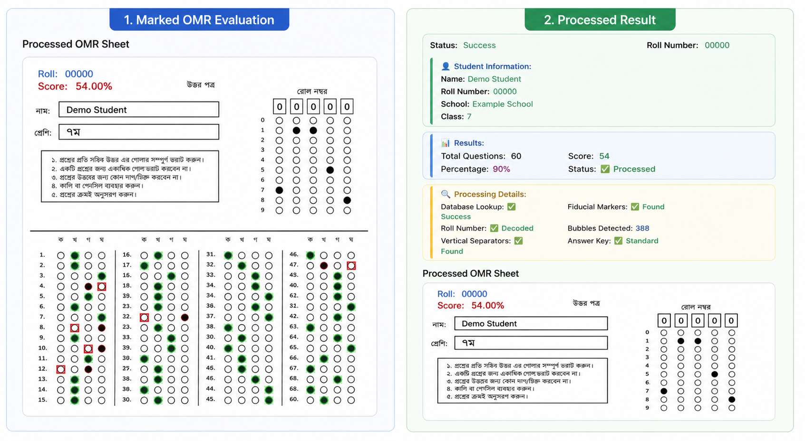
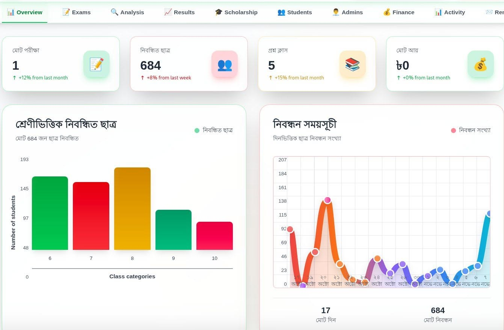
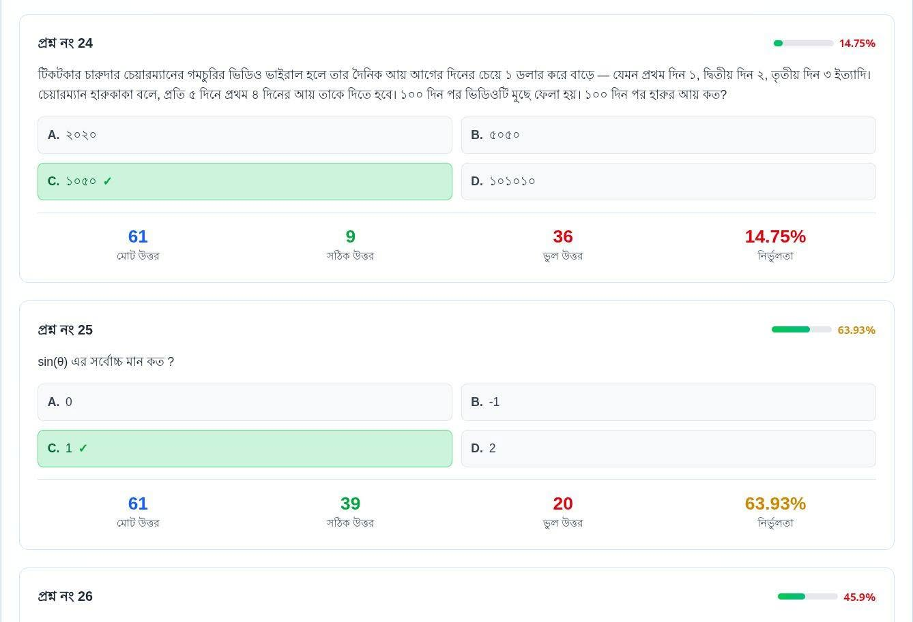

# Exam Portal

**An open-source exam-management platform for registration, assessment
workflows, OMR-assisted result processing, analytics, and printable reports.**

Exam Portal is designed for schools, scholarship examinations, and local
educational organizations that need a practical way to manage exams and publish
results. It combines a Bengali-friendly web interface, a Node.js API,
PostgreSQL storage, OMR integration, and PDF generation.

The project is especially relevant to low-resource educational communities
where exam administration is often manual, result publication is delayed, and
repeated data entry increases the risk of errors.

## Overview

The platform provides separate workflows for students, administrators, and
super administrators. It supports the process from student registration and
exam setup through answer entry, result review, scholarship selection,
reporting, and communication.

The repository contains:

- A React frontend for public, student, admin, and super-admin interfaces
- An Express API for authentication, students, exams, results, finance, PDFs,
  and OMR integration
- A clean PostgreSQL initial migration
- A primary Flask PDF service for question papers, scholarship reports, and
  admit cards
- Backend and frontend integration points for an externally deployed OMR
  processor

## Problem It Solves

Small educational organizations often manage registrations, answer sheets,
ranking, and result publication with spreadsheets or paper records. That
process can be slow, difficult to audit, and prone to mistakes.

Exam Portal brings those workflows into one system so maintainers can:

- Keep student, school, class, exam, and result data connected
- Reduce repetitive result-entry work with OMR-assisted processing
- Review and filter results before publication
- Generate printable question papers, scholarship lists, admit cards, and
  reports
- Track registration and collection summaries from an admin dashboard

## Key Features

- Student registration, login, profile updates, and roll-number lookup
- Admin and super-admin authentication with admin account management
- Exam creation with class-specific questions and answer keys
- Manual, detailed, and OMR-assisted result submission
- Single-sheet and batch OMR image processing
- Result filtering by roll, class, and school
- Scholarship selection and scholarship-result views
- Result analysis, rankings, registration trends, and OMR statistics
- Finance summaries by school, class, and collecting administrator
- Optional SMS reminder integration
- Question-paper preview and PDF generation
- Scholarship-list and admit-card PDF generation
- Bengali interface content and Bengali-friendly document templates

## OMR Evaluation Workflow

OMR-assisted evaluation is the project's central workflow. The system processes
a marked answer sheet, decodes the roll number and selected bubbles, compares
responses with the configured answer key, and presents the evaluation for
review before result submission.



### Additional Screenshots

| Dashboard and activity overview | Question-level answer statistics |
| --- | --- |
|  |  |

The OMR workflow image uses fictional demo data. Screenshots containing
student-identifiable information are intentionally excluded from the public
repository.

## Tech Stack

| Area | Technologies |
| --- | --- |
| Frontend | React 19, Vite 7, Axios, Tailwind CSS/PostCSS, JSZip |
| Backend API | Node.js, Express, JWT, bcrypt, Multer, Axios |
| Database | PostgreSQL, `pg`, `pgcrypto` |
| OMR integration | Express proxy routes and React upload workflows |
| Primary PDF service | Flask, ReportLab, WeasyPrint, Jinja2 |
| Tooling | npm, pip, ESLint, Node test runner, GitHub Actions |

## Architecture

```text
React frontend (5173)
        |
        v
Express API (4000) --------------------> PostgreSQL
        |
        +------------------------------> External OMR processor (optional)
        |
        +------------------------------> Flask PDF service (5000)

```

The frontend communicates with the Express API for application data. The
backend owns database access and proxies most PDF and OMR work. Some current
frontend PDF actions call the primary Flask service directly.

### Project Structure

```text
exam-portal/
├── .github/                  # CI, issue forms, and pull-request template
├── backend/                  # Express API, migration, routes, and tests
├── docs/                     # Deployment, OMR, testing, and screenshots
├── frontend/                 # React/Vite web application
└── pdf_service_flask/        # Flask PDF generation service
```

## Getting Started

### Prerequisites

- Node.js 20 or newer recommended
- npm
- Python 3.11 or newer recommended
- PostgreSQL 15 or a compatible version
- System packages required by OpenCV, ReportLab, or WeasyPrint

### 1. Clone the Repository

```bash
git clone https://github.com/rayhannn2003/Exam-portal.git
cd Exam-portal
```

### 2. Prepare PostgreSQL

Create a database and apply the clean initial migration:

```bash
createdb exam_portal
psql -d exam_portal -f backend/migrations/001_initial_schema.sql
psql -d exam_portal -f backend/schema/student_tracking.sql
psql -d exam_portal -f backend/schema/user_activity_migration.sql
```

The initial migration intentionally creates no default admin credentials.
Apply the activity migrations for the analytics features, then create the first
super-admin with explicit one-time values:

```bash
cd backend
SUPERADMIN_USERNAME=replace_me \
SUPERADMIN_NAME="Local Administrator" \
SUPERADMIN_PASSWORD=replace_with_a_long_password \
npm run bootstrap:superadmin
```

### 3. Run the Backend

```bash
cd backend
cp .env.example .env
npm install
npm run dev
```

The API runs at `http://localhost:4000`.

### 4. Run the Frontend

In a separate terminal:

```bash
cd frontend
cp .env.example .env
npm install
npm run dev
```

Open `http://localhost:5173`.

### 5. Run the PDF Service

The active code paths use the Flask service on port `5000`. It is the only PDF
implementation in the repository with admit-card endpoints.

```bash
cd pdf_service_flask
python3 -m venv .venv
source .venv/bin/activate
pip install -r requirements.txt
cp .env.example .env
./start_local.sh
```

Verify it at `http://localhost:5000/health`.

## Environment Variables

Copy and edit the component examples:

- [`backend/.env.example`](backend/.env.example)
- [`frontend/.env.example`](frontend/.env.example)
- [`pdf_service_flask/.env.example`](pdf_service_flask/.env.example)

Never commit real credentials. The backend requires database settings and a
strong `JWT_SECRET`. SMS settings and the external OMR processor are optional.

## Available Commands

| Component | Command | Purpose |
| --- | --- | --- |
| Frontend | `npm run dev` | Start the Vite development server |
| Frontend | `npm run build` | Create a production frontend build |
| Frontend | `npm run lint` | Run ESLint |
| Frontend | `npm run preview` | Preview the production build |
| Backend | `npm run dev` | Start Express with nodemon |
| Backend | `npm start` | Start Express with Node.js |
| Backend | `npm test` | Run backend middleware tests |
| Backend | `npm run bootstrap:superadmin` | Create the first super-admin |
| Primary PDF service | `./start_local.sh` | Start Flask on port `5000` |
| Repository | `./scripts/verify-local-services.sh` | Check local service health |

Additional integration scripts exist throughout the repository. Review them
before running because some expect specific local ports, database records, or
sample files.

## Documentation

- [Documentation index](docs/README.md)
- [Deployment guide](docs/deployment.md)
- [OMR integration guide](docs/omr/integration.md)
- [OMR result workflow](docs/omr/workflow.md)
- [Postman testing guide](docs/testing/postman.md)
- [Activity tracking overview](docs/activity/overview.md)
- [Activity tracking testing guide](docs/activity/testing.md)
- [Primary Flask PDF service](pdf_service_flask/README.md)

## Roadmap

- Document and package a compatible external OMR processor
- Expand backend, frontend, OMR, and PDF automated test coverage
- Resolve the existing frontend lint backlog and make lint blocking in CI
- Strengthen production authentication, authorization, CORS, and upload limits
- Improve accessibility and responsive behavior
- Add complete, tested deployment orchestration when the service contracts are
  stable

## Contributing

Contributions that improve reliability, documentation, accessibility, tests,
or deployment are welcome. Read [CONTRIBUTING.md](CONTRIBUTING.md) before
opening a pull request.

## Security

Do not commit credentials, API keys, real student data, or private exam
materials. Read [SECURITY.md](SECURITY.md) for reporting and deployment
expectations.

Credentials that previously appeared in tracked `.env` files must be rotated
through their database or service providers before public deployment.

## License

Licensed under the [MIT License](LICENSE).

## Maintainer

Maintained by [@rayhannn2003](https://github.com/rayhannn2003). The project is
open to focused contributions and review from developers interested in
education technology, document generation, and practical exam-management
workflows.
